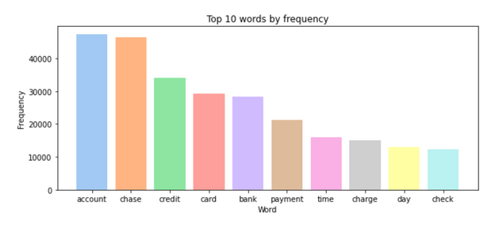
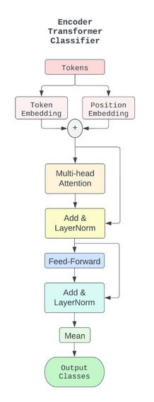
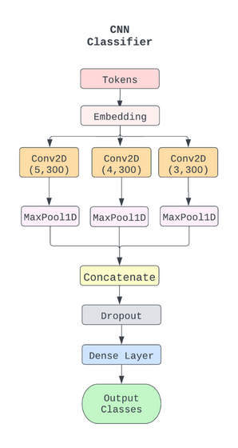
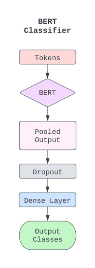

### Support Ticket Classification

---

* Dataset:
  * TicketDataset is the class I used to transform the data in the dataset object into the correct format for the dataloader object. This also works as a generator which increases overall efficiency.
  * For more information, you can see the code in the **utils** folder under **data.py**.
    ` `

* Models:
  * **EncoderTransformer** is my implementation of a transformer ticket classifier.
  * **ConvNet** is my approximation of the neural network described in the paper: *Hyperparameter Black-Box Optimization to Improve the Automatic Classification of Support Tickets*, which I am trying to improve upon with my EncoderTranformer.
  * **BertClassifier** is derived from https://github.com/marcellusruben/medium-resources/blob/main/Text_Classification_BERT/bert_medium.ipynb
  * The first two models are the main focus of the project, the Bert model was just out of interest to see how a much larger pre-trained language model did when finetuned on this task.
    ` `

 
 
 

## Contents

#### data:

This folder contains the preprocessed tickets used for training the models.

#### logs:

The folder used to hold logging outputs from my Python training script. Contains results which are described in the project report.

#### models:

Here we have the trained models which can be used to achieve similar results on inference.

#### scripts:

Contains a variety of scripts which I wrote to test and handle different aspects of the project. The main scripts are present in the root of this folder.

- **model_eval.py**:
  This script was used to log the cross-validation performance of the models. This script should run 10-fold cross-validation on each of the models and get the respective scores.
- **ticket_classification.py**:
  This is the barebones script which creates a model, trains it, and saves it. Code for each model is commented out to selectively train the model in question.

#### project.ipynb:

Contains a well-documented overview of the main aspects of the project along with some performance scores at the end.

#### utils:

This folder contains a large number of classes and methods I created to run the code and get the results I used.

- **data.py**:
  Contains methods and classes related to the Dataset/Dataloader the model is trained on.
- **models.py**:
  Contains the model I created and those I derived from the referenced works.
- **model_utils.py**:
  Contains methods for working with said models.

---

* **Note:** I have spent time practicing prompt engineering with chatGPT and used this as a tool to outline and laydown some of the code I developed in this assignment. I treated this as outside information equivalent to StackOverflow and changed the implementation to fit my style and usage. I did not copy and paste any code. I also spent time verifying that all phases of my project work as intended.
* The parts which used chatGPT to lay the groundwork are the Dataset class implementation and the CrossValidation method (which is used in model_eval.py to generate the reported scores).
* Besides this I mainly used it for some general formatting and cleaning up of the code I wrote along with debugging.

- **utils.py**:
  Contains a variety of general helper functions.

This organization provides clear headings and subheadings for each section and improves the readability and understanding of the file structure in the repository.
